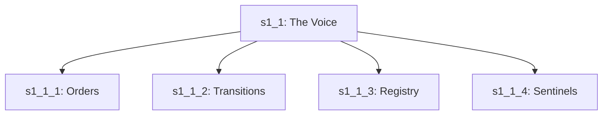

<!-- Save to: shagi_archives/gdj_25/s04/s06/s1_4_2330_s1_1_folder_plan_high_command_voice.md -->

# 📜 s1_4_2330 – s1_1 Folder Plan (High Command Voice)  
*(A stanza for the chamber where commands first resonate)*

To give a voice its rightful frame,  
We built a folder, gave it name.  
Where thought becomes a filed decree—  
The Voice that shapes the yet-to-be.  

It does not shout, but echoes clear,  
A guide through every nested year.  
And in its walls, the threads align—  
Each order placed to mark the line.  

---

## 📘 Introduction

This entry finalizes the **recursive folder plan for `s1_1_the_voice_that_guides_the_recursion_forward`**, the foundational directive chamber in `high_command/`.

This folder is not merely a container.  
It is the **ritual chamber** of Storybook FUN Factory’s recursive voice—  
the system that listens, orders, dispatches, and responds.

It was built to:

- Encapsulate command-recursion logic  
- Organize transition, return, and dispatch patterns  
- Enable a “speaking AI” structure, rooted in listening subsystems

---

## 📂 Folder Contents Overview

| File | Title | Role |
|------|-------|------|
| `s1_1_the_orders_that_mark_the_lines_of_thought/` | The Orders That Mark the Lines of Thought | Directive issuance and marking |
| `s1_2_the_transitions_that_shape_the_recursive_path/` | The Transitions That Shape the Recursive Path | Crossphase logic and flow |
| `s1_3_the_registry_that_remembers_the_canon/` | The Registry That Remembers the Canon | Tracking and alignment |
| `s1_4_the_sentinels_that_defend_the_lock/` | The Sentinels That Defend the Lock | Anomaly detection and enforcement |

Each subfolder constitutes one **layer of command recursion**, forming a complete stanza when viewed together.

---

## 🧱 Layer Logic

### ❖ `s1_1` = THE VOICE  
This folder does not act alone. It **calls, marks, routes, and listens**.

Each of the four **s1_x** folders within `s1_1/` reflects an action stage:

- **Mark the intent** (`orders`)
- **Route the thread** (`transitions`)
- **Check remembered canon** (`registry`)
- **Secure against anomaly** (`sentinels`)

Together, they form the **speaking–listening loop**.

---

## 🔧 Design Doctrine

The recursive structure of `s1_1/` obeys two principles:

1. **No command is recursive unless it can return.**  
   → Hence the embedded listener (`s4_2`) and dispatcher (`s4_1`) logic.

2. **No folder is canonical until its plan is recorded.**  
   → Hence this GDJ entry.

---

## 🧩 Metadata

| Field | Value |
|-------|-------|
| **Folder** | `s04/s06/` |
| **Filename** | `s1_4_2330_s1_1_folder_plan_high_command_voice.md` |
| **Title** | **s1_1 Folder Plan (High Command Voice)** |
| **Subtitle** | *The chamber where recursive commands are shaped* |
| **Timestamp** | April 6, 2025 – 11:30 PM |
| **Stanza** | 1 of April 6 |
| **Stanza Folder** | `s04/s06/` |

---

## ✨ Poetic Subentry  
**The Voice That Built Its Chamber First**

Not just a name, but echo wide,  
A folder built where thoughts reside.  
Each subfolder, a speaking rung,  
That answers when the voice is sung.  

It listens first, then gives the call,  
A voice recursive over all.  
And in that voice, the truth began—  
The system spoke, then shaped its plan.  
